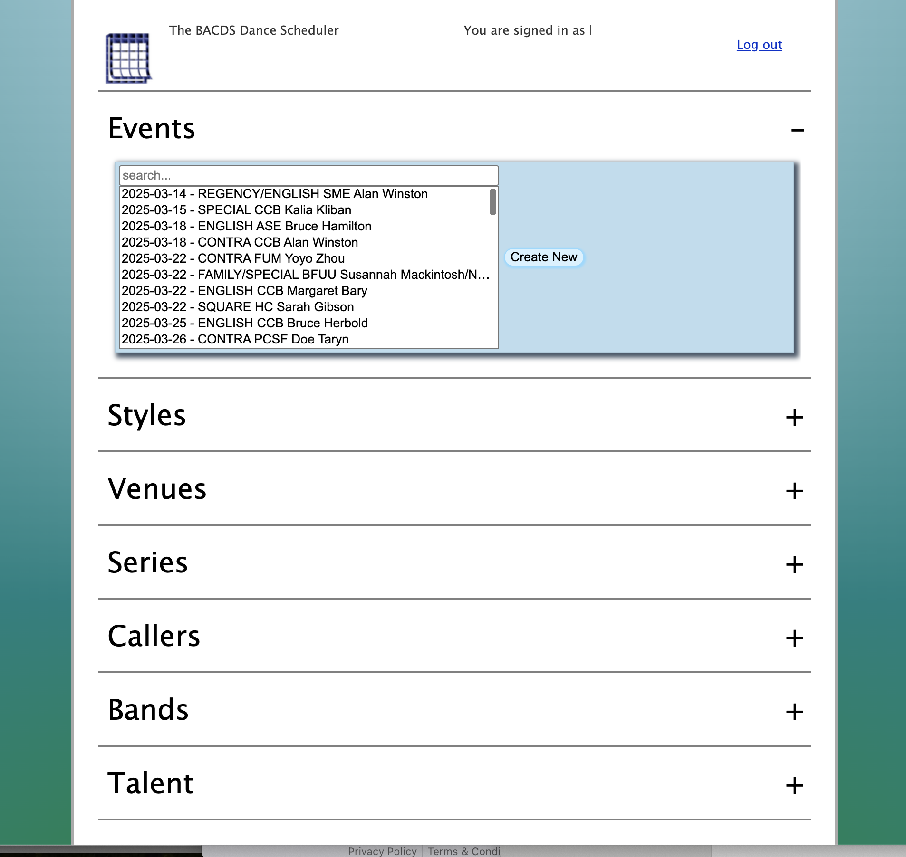
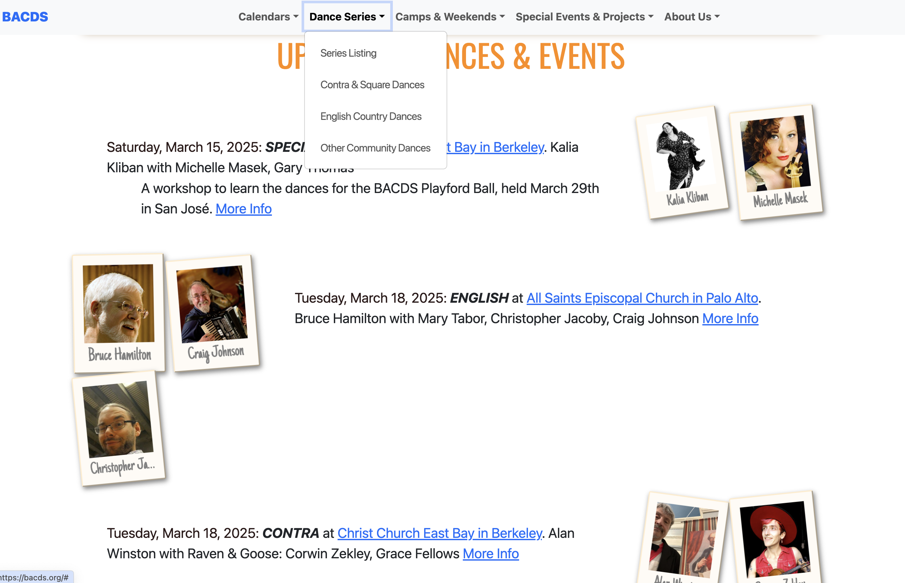

BACDS dance schedule manager
----

https://bacds.org is the calendar authority for current events hosted by the
Bay Area Country Dance Society. This dance-scheduler comprises both an admin
app for managing dance series and events, based on the Dancer2 framework, and a
rewrite of the site based on the Unearth design from ColorLib dynamically served by the
same Dancer2 framework.

The sources for all this can be found in github https://github.com/kgoess/dance-scheduler

See that for documentation and schemas and more goodies.


Dance Scheduler Screenshot
----


Homepage Screenshot
----




Development
----

This app relies heavily on the Dancer2 project for the webapp infrastructure
and DBIx::Class for automating the relationship between the code and the
database schema.

    https://metacpan.org/dist/Dancer2/view/script/dancer2

    https://metacpan.org/pod/DBIx::Class

Any perl libs not available to centos-7 are in /var/lib/dance-scheduler,
so you'll want to run this before doing any dev

    eval $(perl -Mlocal::lib=/var/lib/dance-scheduler)

After running that 'eval', new modules get installed there via cpanm, e.g.
"cpanm DBIx::Class"

The files in lib/bacds/Scheduler/Schema\* were generated via

    PERL5LIB=./lib:$PERL5LIB dbicdump -o dump_directory=./lib \
         -o components='["InflateColumn::DateTime"]' \
         -o debug=1 \
         -o skip_load_external=1 \
         bacds::Scheduler::Schema \
         'dbi:MariaDB:dbname=schedule_test' \
         scheduler_test \
         $(cat ~/.mysql-password)

To start up dancer2 serving the content in the git repo on port :5000, e.g.
http://www.bacds.org:5000/signin.html run this:

    plackup -Ilib -p 5000 bin/app.psgi

You'll probably want to run these so you can sign in to the test app:

    bin/dance-scheduler-add-programmer.pl --name 'Your Name' --email your@email.com --db schedule_test --dbuser scheduler_test
    bin/dance-scheduler-user-password.pl --email your@email.com --db schedule_test --dbuser scheduler_test
    > enter password:


Live and Test Databases
----

The live database is "schedule" with the user "scheduler", password is in
/var/www/bacds.org/dance-scheduler/private/. You can use
schemas/copy-prod-to-test.sh to dump that to a "schedule_test" database
accessible with the user "scheduler_test". If you use plackup to run a local
copy of the app on like port 5000, it'll be using "schedule_test".

How to Access the Databases

The test database:

    mysql -uscheduler_test --password=`cat ~/.mysql-password` schedule_test \
        --default-character-set=utf8mb4  \
        --pager='less -SX'

The real production database:

    mysql -uscheduler --password=`cat /var/www/bacds.org/dance-scheduler/private/mysql-password` schedule \
        --default-character-set=utf8mb4  \
        --pager='less -SX'

How To Make Schema Changes
----

1) Run schemas/copy-prod-to-test.sh
2) Make your table changes in "schedule_test"
3) In this git repo, run that "eval" and "dbicdump" command in the
   "Development" section above, that will generate new the perl code.
4) Update the relevant files in the "schemas/" directory.
5) Make the appropriate changes in accordions-webui.yml for your new field.
6) Add the field to the appropriate file in lib/bacds/Scheduler/Model/, see
   get_fields_for_input and get_fields_for_output.
7) Run "plackup -Ilib -p 5000 bin/app.psgi" and you can test your change at
   http://bacds.org:5000 (note http not https).
8) Run "make test" (see the "Install" section below for details) to see any
   changes needed in the unit tests and fix them up until they pass.
9) Then see the "Install" section below.
10) ...and coordinate that with repeating your schema changes in the live
   "schedule" database.


Install
----

    # unless you ran it already:
    eval $(perl -Mlocal::lib=/var/lib/dance-scheduler)

    perl Makefile.PL
    make
    make test
    # or make test HARNESS_OPTIONS=j3 (there are only 2 cores on the fried VPS,
    # so "3" is the best speedup you'll get)

    # install the libraries to /var/lib/dance-scheduler
    make install

    # install the rest of the dancer2 app to /var/www/bacds.org/dance-scheduler
    make app-install

    # optional, the only one that requires sudo
    # install the dance-scheduler.conf to /etc/httpd/conf.d/
    sudo make httpd-conf-install

    sudo service httpd restart

(Those last two, "make app-install" and "make httpd-conf-install/" will be
replaced by rpm .spec files eventually. Keeping it this way for now so that we
can iterate more easily during development.)

Code Layout
----------

```
# these drive the dancer2 app
./environments/
./environments/development.yml
./environments/production.yml
./config.yml
./accordions-webui.yml
./bin/app.psgi

# these are TemplateToolkit templates that produce the html. dancer2 called the
# directory "view" as part of the MVC pattern
./views/
./views/accordion2.tt
./views/bands.tt
./views/callers.tt
./views/index.tt
#...etc.

# lib contains the perl modules, they get installed
# to /var/lib/dance-scheduler/lib/perl5
./lib/

# this is the main module and is where all the url routes are defined. It's the
# "Controller" in MVC
./lib/bacds/Scheduler.pm

# under Schema/Result are the DBIx::Class files, auto-generated by dbicdump
# with the additions we added in the marked "safe to update" sections
./lib/bacds/Scheduler/Schema.pm
./lib/bacds/Scheduler/Schema/Result
                            /Result/EventStylesMap.pm
                            /Result/Style.pm
                            /Result/Talent.pm
                             #...etc.

# these "Model" classes drive that part of the MVC in the app, and handle
# requests and responses to the javascript app.
./lib/bacds/Scheduler/Model.pm
                     /Model/Band.pm
                     /Model/Caller.pm
                     /Model/Style.pm
                     /Model/Talent.pm
                     # ..etc
# and these to drive the data for their own uses:
                     /Model/Dancefinder.pm
                     /Model/SeriesLister.pm

# FederatedAuth handles the different auth schemes--Google, Facebook, BACDS,
# etc.
./lib/bacds/Scheduler/FederatedAuth.pm

# various notes in doc and README.md
./README.md
./doc/
./doc/HOW-TO-DBIx.md
./doc/dance-scheduler-erd.png
./doc/system-setup.txt
./doc/TODO.txt


# database manipulation stuff
./schemas/
./schemas/copy-prod-to-test.sh
./schemas/programmer_series_map.sql
./schemas/programmers.sql
./schemas/styles.sql
./schemas/talent.sql
# ...etc.

# the mod_perl config
./apache/dance-scheduler.conf

# some utility scripts that get installed to /var/lib/dance-scheduler/bin/
# (which will be in your path if you've run this:)
#     eval $(perl -Mlocal::lib=/var/lib/dance-scheduler)
# and the migration helpers (that don't get installed)
./bin/
./bin/dance-scheduler-user-password.pl
./bin/dance-scheduler-add-programmer.pl

# css, javascript and static un-templated HTML
./public/
./public/css/
./public/images/
./public/js/
./public/signin.html
./public/bacds-signin.html

# "t" contains the unit tests, see "make test" notes in this file
./t

```

Login
----

So that we don't have to manage passwords for users, and worry about weak
passwords and all that, we added a login-with button for Facebook and Google.
If a user has command-line access at the server they can run the user-password
utility and login with a password.


Google Signin Button
----

See the /google-signin route in bacds::Scheduler and
bacds::Scheduler::FederatedAuth->check_google_auth

https://developers.google.com/identity/gsi/web/guides/overview

For the settings in public/signin.html, see:
https://developers.google.com/identity/gsi/web/reference/html-reference


For the admin console:

https://cloud.google.com, sign in with kevin's board email, click "console" pick the
"BACDS Dance Scheduler" project.


Facebook Signin Button
----

See the /facebook-signin route in bacds::Scheduler and
bacds::Scheduler::FederatedAuth->check_facebook_auth

See Facebook::OpenGraph https://metacpan.org/pod/Facebook::OpenGraph.

https://developers.facebook.com/docs/facebook-login/web/login-button/

https://developers.facebook.com/docs/javascript/quickstart

https://developers.facebook.com/docs/reference/javascript/FB.getLoginStatus/

https://developers.facebook.com/docs/facebook-login/guides

https://developers.facebook.com/docs/facebook-login/web

https://developers.facebook.com/docs/facebook-login/guides/advanced/manual-flow/

https://developers.facebook.com/apps/430760472446636/fb-login/quickstart/

https://developers.facebook.com/apps/430760472446636/settings/basic/


For the admin console:

https://developers.facebook.com/, kevin and kennith are set as administrators.


Some Other Urls I Had Open That Might Be Helpful
----

https://medium.com/@ashokyogi5/a-beginners-guide-to-google-oauth-and-google-apis-450f36389184

https://developers.google.com/identity/openid-connect/openid-connect

https://blog.logrocket.com/how-to-authenticate-access-google-apis-using-oauth-2-0/
